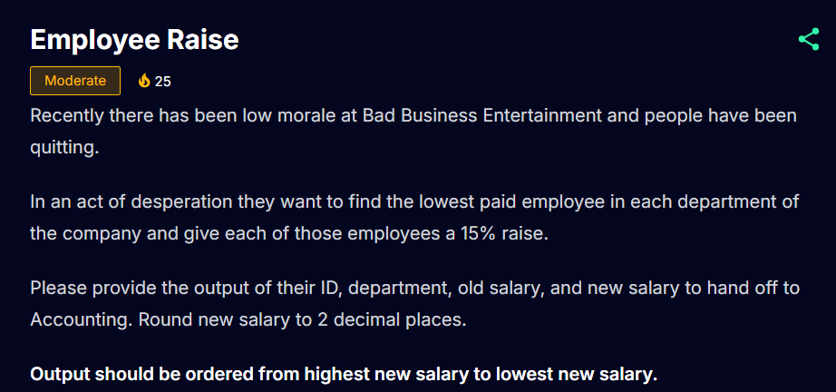
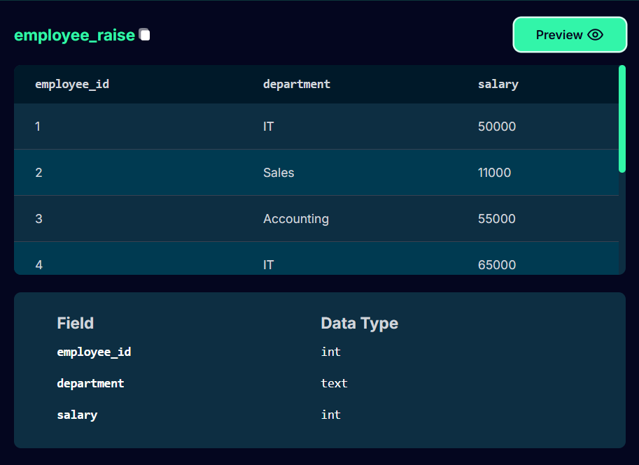
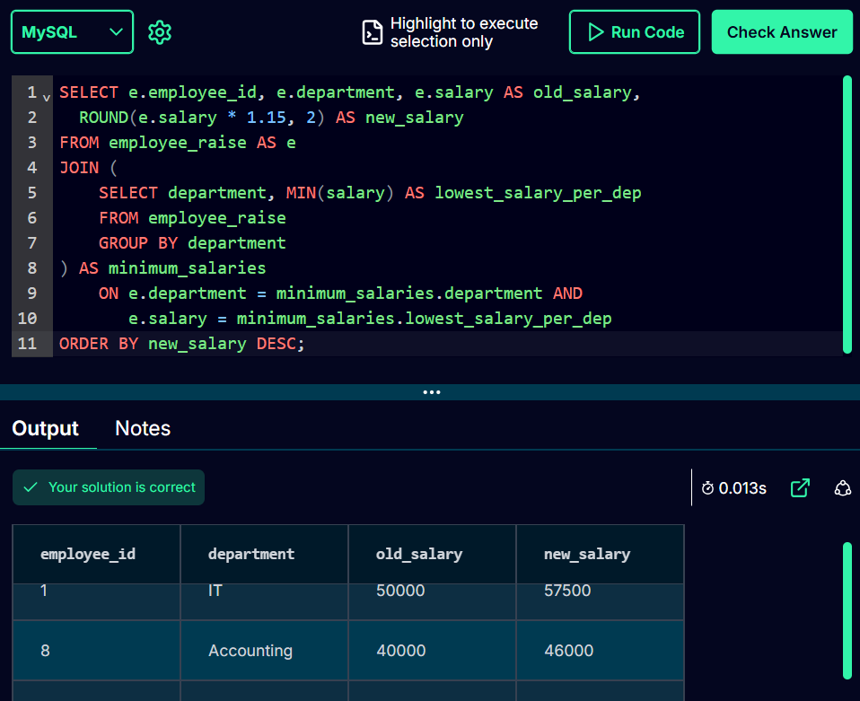

## Data Analysis - Daily Practice of 4

> [!IMPORTANT]
> These practice sets include MySQL, Python (mostly Pandas), Excel, and Power BI to solve a question/business request.

> [!TIP]
> This is helpful for data aspirants or those who don't use some of these tools in their workplace as much.

- You can check my LinkedIn post for a detailed approach [here](https://www.linkedin.com/posts/alihanemretunc_daily-practice-of-4-mysql-python-excel-activity-7288184375127531520-a-V2?utm_source=share&utm_medium=member_desktop). 

- One example is below:

## Question

## Preview

## An SQL Solution

- I plan to update this repository once in a while.

### Thank you 🙂
